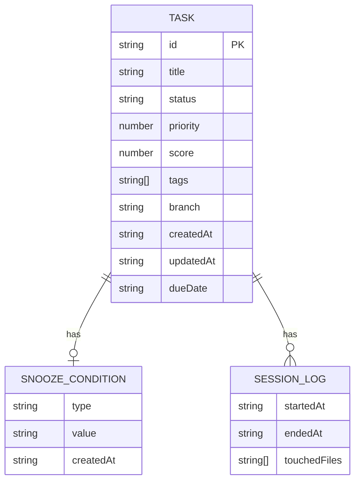
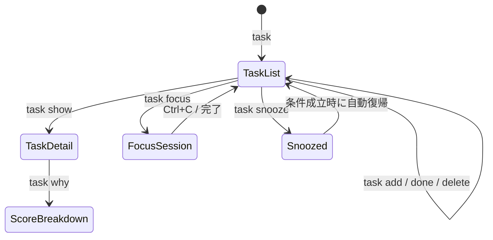

# 機能設計書

## コンポーネント設計

```
┌─────────────────────────────────────────────┐
│                   CLI Layer                  │
│  (コマンドパース・バリデーション・出力整形)       │
└──────────────────┬──────────────────────────┘
                   │
┌──────────────────▼──────────────────────────┐
│               Core Layer                     │
│  ┌─────────────┐  ┌────────────────────┐    │
│  │ TaskManager │  │  ScoringEngine     │    │
│  │ (CRUD)      │  │  (優先度スコア計算) │    │
│  └─────────────┘  └────────────────────┘    │
│  ┌─────────────┐  ┌────────────────────┐    │
│  │ GitContext  │  │  SnoozeManager     │    │
│  │ (ブランチ等) │  │  (条件付き延期)    │    │
│  └─────────────┘  └────────────────────┘    │
└──────────────────┬──────────────────────────┘
                   │
┌──────────────────▼──────────────────────────┐
│               Storage Layer                  │
│  (JSON ファイル読み書き・バックアップ)          │
└─────────────────────────────────────────────┘
```

---

## データモデル定義

### Task

```
Task
├── id: string          # nanoid（例: "abc123"）
├── title: string       # タスクタイトル
├── status: enum        # "open" | "done" | "snoozed"
├── priority: number    # ユーザー手動設定（1=低, 2=中, 3=高）
├── score: number       # 自動計算スコア（0〜100）
├── tags: string[]      # タグ（例: ["bug", "auth"]）
├── branch: string?     # 紐付けブランチ名
├── createdAt: string   # ISO 8601
├── updatedAt: string   # ISO 8601
├── dueDate: string?    # ISO 8601
├── snoozeUntil: SnoozeCondition?
└── sessionLog: SessionLog[]
```

### SnoozeCondition

```
SnoozeCondition
├── type: enum          # "datetime" | "branch"
├── value: string       # datetime なら ISO 8601、branch なら branch 名
└── createdAt: string
```

### SessionLog

```
SessionLog
├── startedAt: string   # ISO 8601
├── endedAt: string?    # ISO 8601
└── touchedFiles: string[]  # 作業中に変更したファイルパス一覧
```

### ER 図



---

## 優先度スコアリング設計

スコアは 0〜100 の数値で、複数のシグナルを重み付き合算して算出します。

### シグナルと重み

| シグナル | 重み | 計算方法 |
|---|---|---|
| ユーザー手動優先度 | 30% | priority 1→10点, 2→20点, 3→30点 |
| Git ブランチ一致 | 25% | 現在のブランチ名とタスクの `branch` が一致で 25点 |
| タスクの古さ（stale） | 20% | 作成から 7日以内: 20点, 14日以内: 10点, それ以上: 0点 |
| 期限の近さ | 15% | 今日: 15点, 3日以内: 10点, 7日以内: 5点 |
| ブロッカー | 10% | 他タスクの依存元になっている場合: 10点 |

### スコア計算例

```
タスク: "Fix JWT expiry bug"
  手動優先度: 3 (高)    → 30点
  ブランチ一致: feat/auth → 25点
  作成日: 3日前         → 20点
  期限: 明日            → 10点
  ブロッカー: なし       →  0点
  ────────────────────────────
  合計スコア: 85点
```

### `task why` の出力形式

```
$ task why abc123

Task: Fix JWT expiry bug [score: 85]

  [30/30] Manual priority: HIGH
  [25/25] Branch match: feat/auth (current: feat/auth)
  [20/20] Freshness: created 3 days ago
  [10/15] Due date: due tomorrow
  [ 0/10] Blocker: not blocking any task
```

---

## コマンド設計（ユースケース）

### 画面遷移図



### コマンド一覧

| コマンド | 説明 | 例 |
|---|---|---|
| `task` | スコア順タスク一覧を表示 | `task` |
| `task add <title>` | タスク追加 | `task add "Fix login bug" --tag=bug --priority=3` |
| `task done <id>` | タスク完了 | `task done abc123` |
| `task delete <id>` | タスク削除 | `task delete abc123` |
| `task show <id>` | タスク詳細表示 | `task show abc123` |
| `task edit <id>` | タスク編集 | `task edit abc123 --title="New title"` |
| `task why <id>` | スコア根拠表示 | `task why abc123` |
| `task snooze <id>` | タスク延期 | `task snooze abc123 --until branch:main` |
| `task focus <id>` | フォーカスセッション開始 | `task focus abc123` |
| `task now` | 最優先タスク 1 件のみ表示 | `task now` |

### `task` 一覧の出力形式

```
$ task

  Branch: feat/auth | 2026-05-13 10:30

  [85] abc123  Fix JWT expiry bug          #bug #auth    due: tomorrow
  [72] def456  Write auth unit tests       #test         due: this week
  [41] ghi789  Update README               #docs
  [23] jkl012  Refactor payment module     #refactor     snoozed: branch:payment

  3 open  1 snoozed  12 done
```

---

## ファイル構成（ストレージ）

```
~/.devtask/
├── tasks.json        # タスクデータ本体
├── config.json       # ユーザー設定
└── backups/
    └── tasks.2026-05-13.json   # 日次バックアップ
```

### tasks.json の形式

```json
{
  "version": 1,
  "tasks": [
    {
      "id": "abc123",
      "title": "Fix JWT expiry bug",
      "status": "open",
      "priority": 3,
      "score": 85,
      "tags": ["bug", "auth"],
      "branch": "feat/auth",
      "createdAt": "2026-05-10T09:00:00Z",
      "updatedAt": "2026-05-13T08:00:00Z",
      "dueDate": "2026-05-14T00:00:00Z",
      "snoozeUntil": null,
      "sessionLog": []
    }
  ]
}
```

---

## Git コンテキスト取得設計

Git リポジトリ内で `task` を実行した場合、以下の情報を取得してスコアリングに利用します。

```
取得する情報:
  - 現在のブランチ名  (git rev-parse --abbrev-ref HEAD)
  - 直近で変更したファイル一覧  (git diff --name-only HEAD)

取得できない場合（Git 管理外ディレクトリ）:
  - Git シグナルのスコアを 0 として計算
  - エラーは表示しない（静かに無視）
```

---

## フォーカスセッション設計

```
$ task focus abc123

  ┌─────────────────────────────────────┐
  │  Focus: Fix JWT expiry bug          │
  │  ──────────────────────────────── │
  │  ⏱  25:00  [Pomodoro]              │
  │                                     │
  │  [Ctrl+C] Stop session              │
  └─────────────────────────────────────┘

セッション終了時:
  Session ended: 24m 32s
  Files touched:
    - src/auth/jwt.ts
    - src/auth/jwt.test.ts
```

セッション中は `git diff --name-only` を 30 秒ごとにポーリングして `touchedFiles` に記録します。
