# Section2 クラウドの概念

## TL;DR
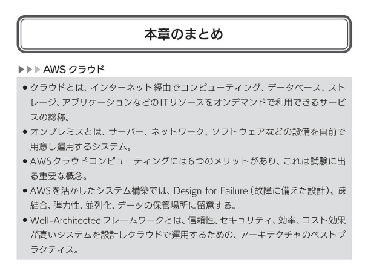
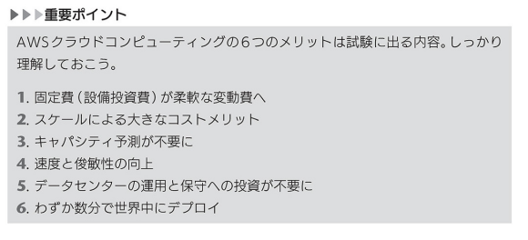
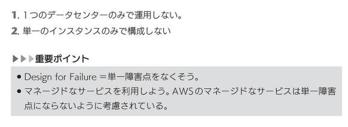
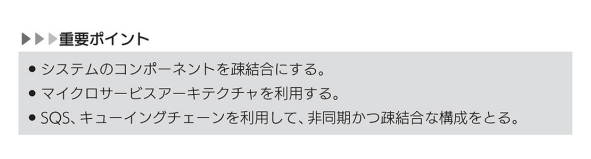
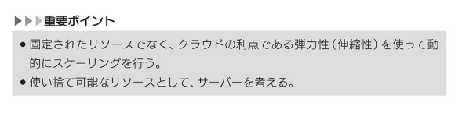
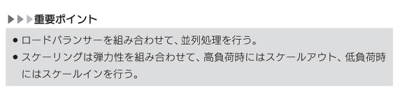
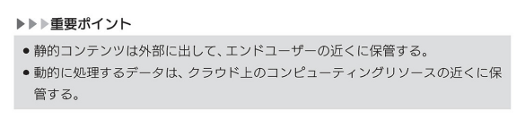

## Practice
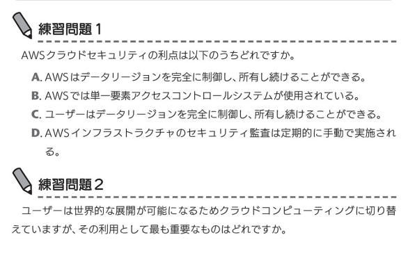
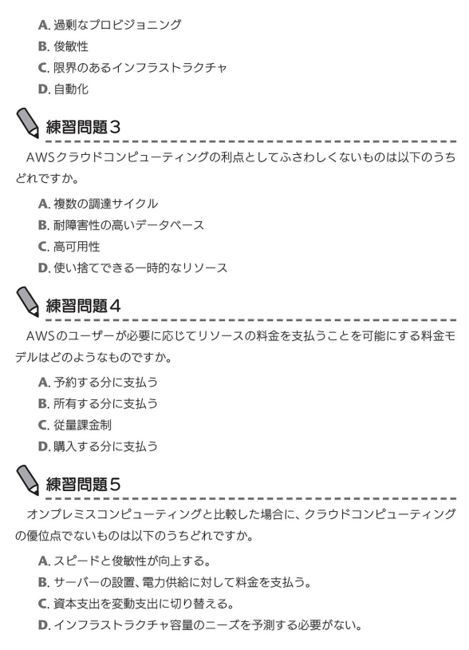
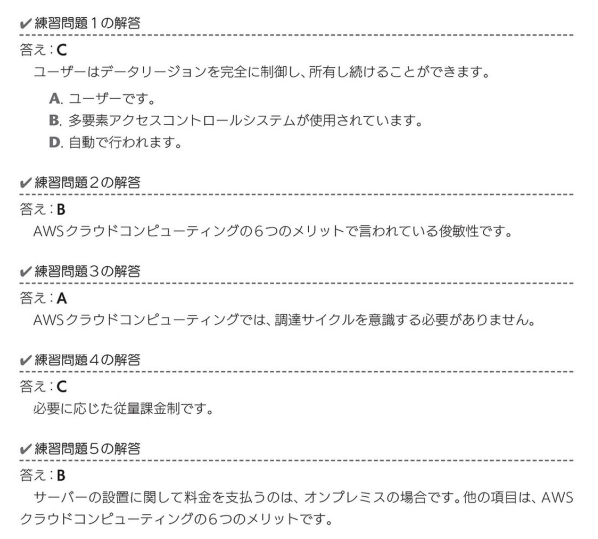

## AWSクラウドコンピューティング6つのメリット
1. 固定費が柔軟な変動費へ
2. スケールによる大きなコストメリット
3. キャパシティ予測が不要に
4. 速度と俊敏性の向上
5. データセンターの運用と保守への投資が不要に
6. わずか数分で世界中にデプロイ

**固定費が柔軟な変動費へ**
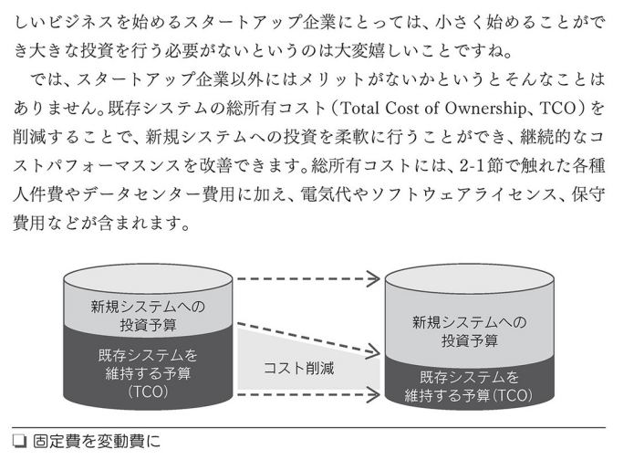

**スケールによる大きなコストメリット**
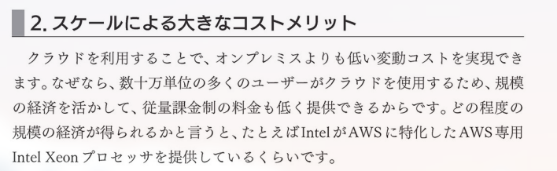

**キャパシティ予測が不要に**
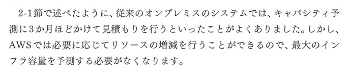
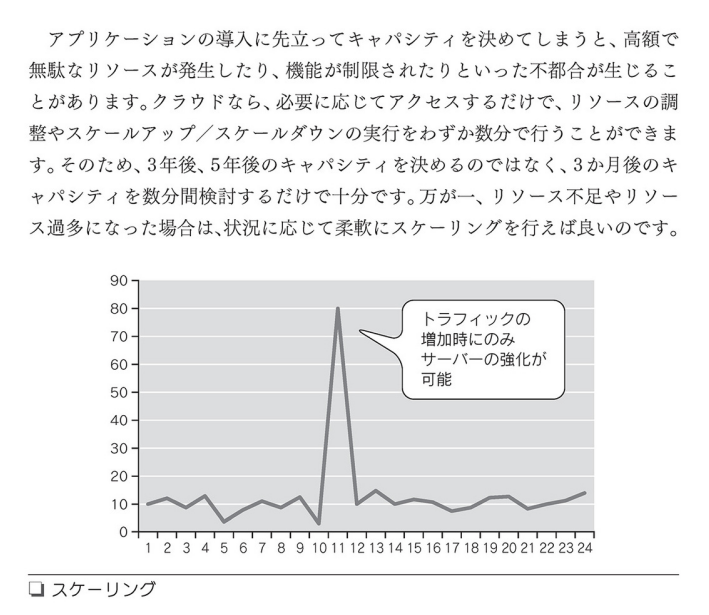

**速度と俊敏性の向上**
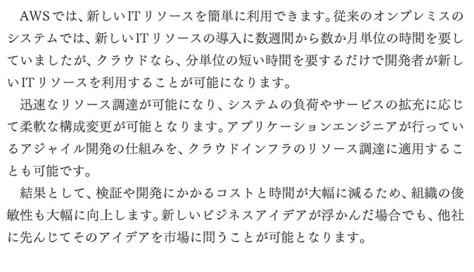

**データセンターの運用と保守への投資が不要に**
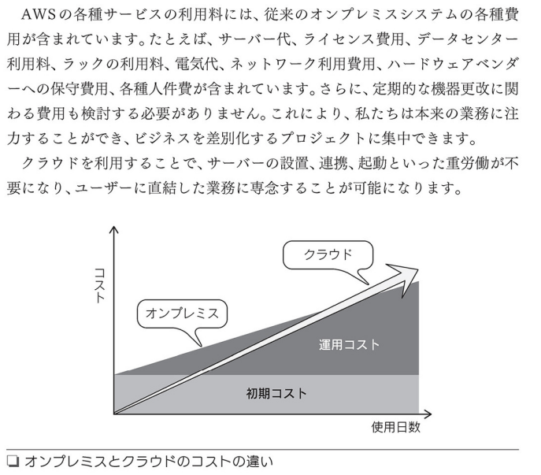

**わずか数分で世界中にデプロイ**
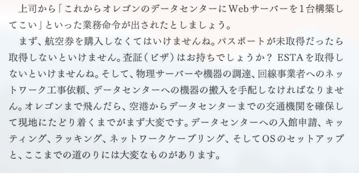
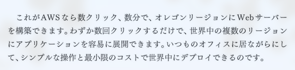

## Design for Failure
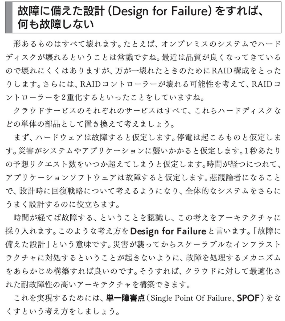

## コンポーネントの分離
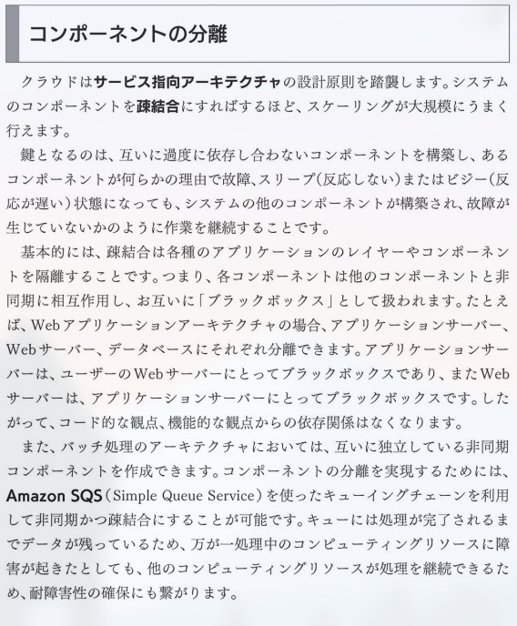
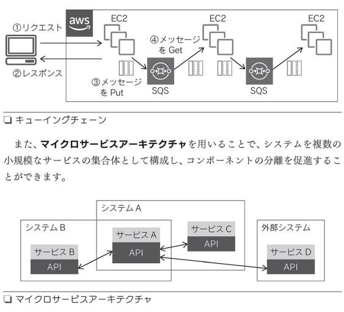

## 弾力性
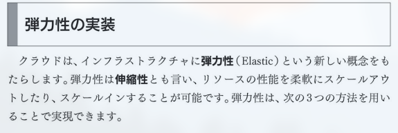
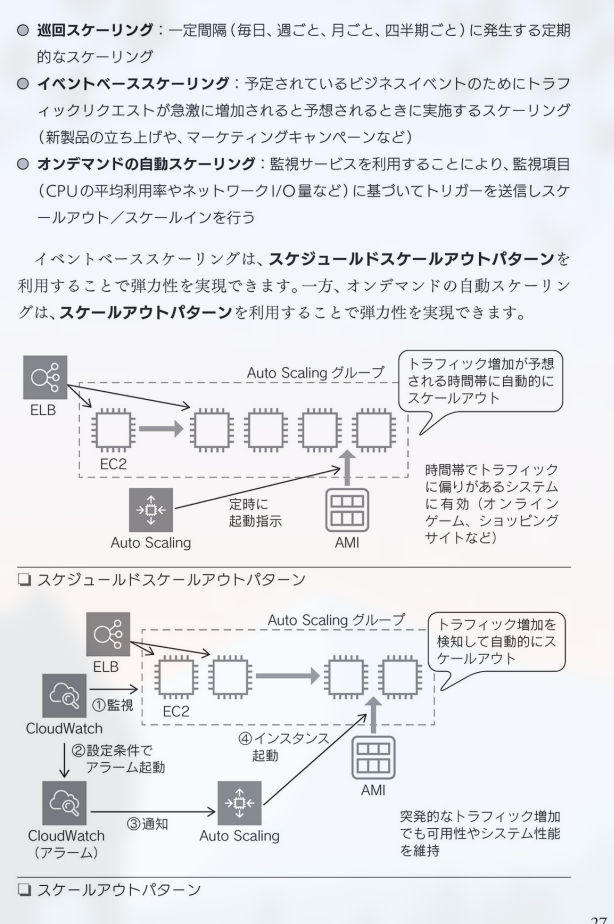

## 並列化
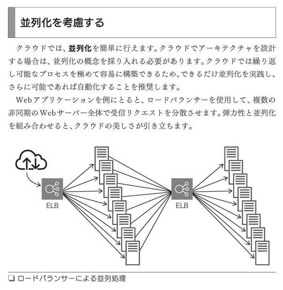
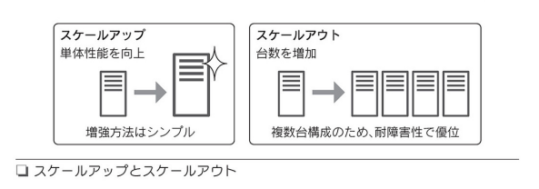

## CDN
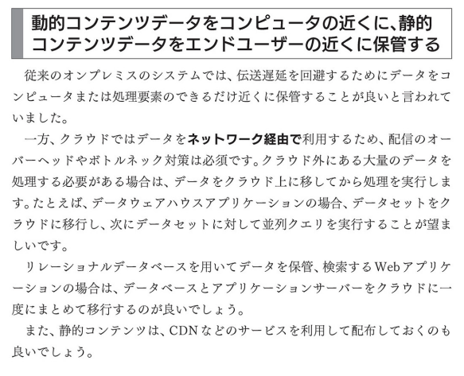
