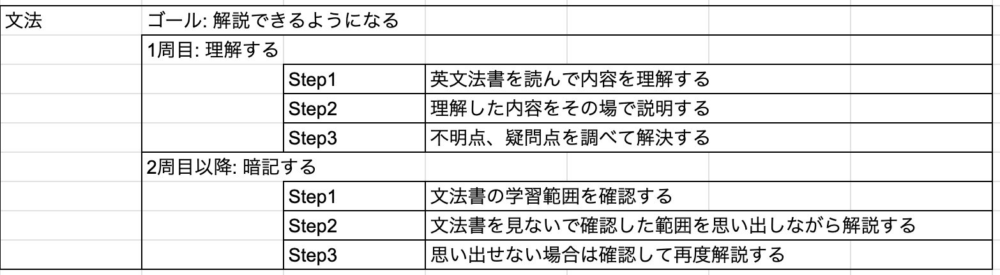
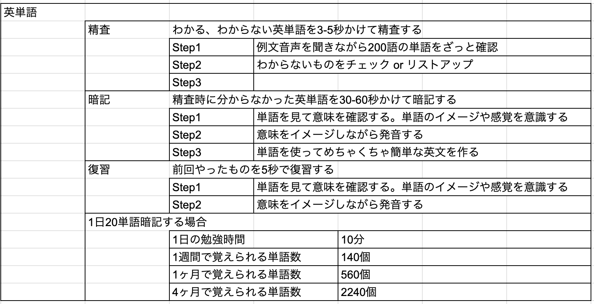
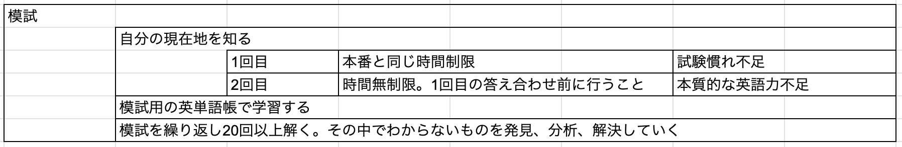
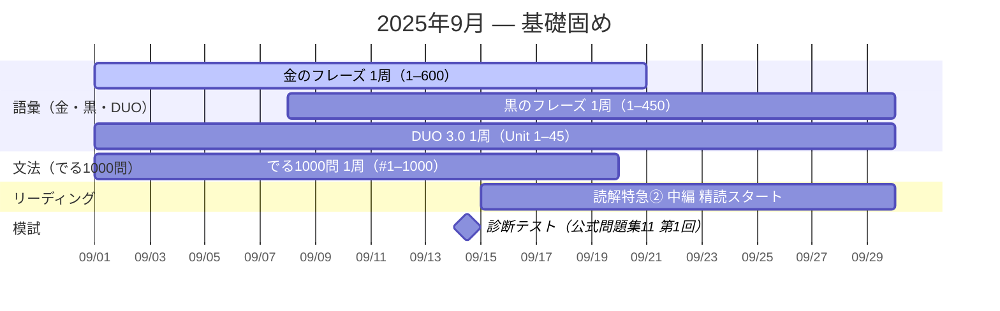
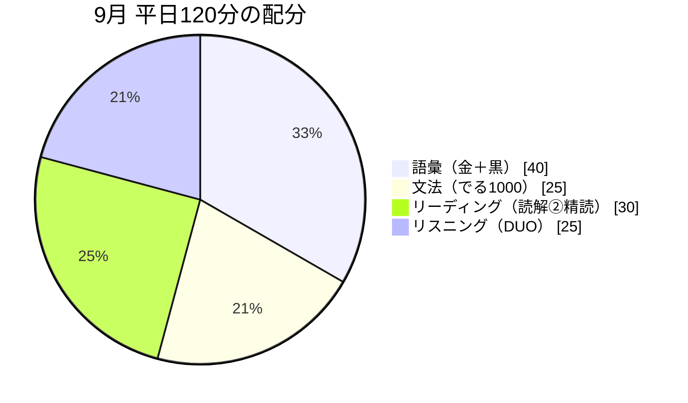
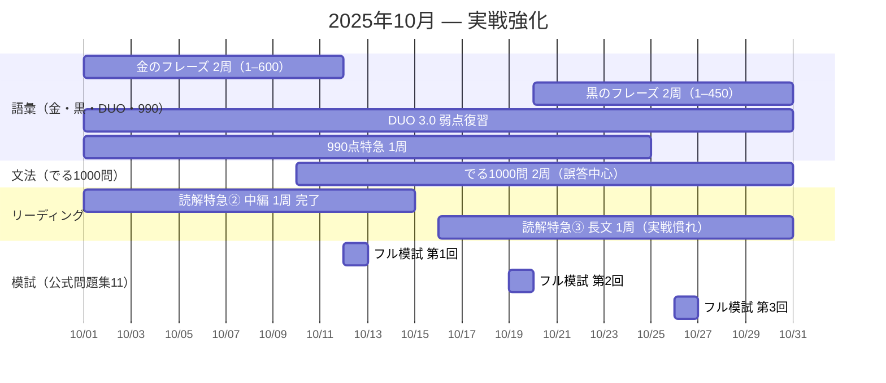
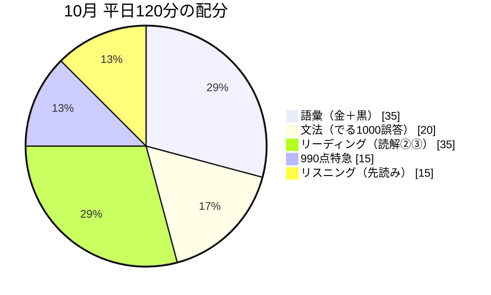
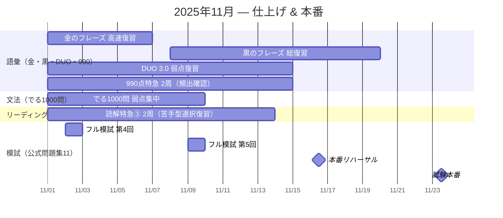

## 現状
- TOEICスコア: 780 (2022)
- 日常英会話には困らない

## 勉強方法

- 単語
  - 勉強方法
    - 朝30分: 英単語の精査 400問 (1問5秒)
    - 夜15分: わからなかった単語の復習
  - 参考書
    - 金フレ
    - Duo
    - 黒フレ
    - 990点攻略　単語・フレーズ
- 文法
  - 勉強方法
    - 朝20分: 100問 (1問10秒)
    - 夜10分: 復習
  - 参考書
    - TOEIC L&Rテスト 文法問題 でる1000問
    - 動画英文法2700
- リーディング
  - 読解特急2
  - 読解特急3
  - 金の読解

## September

平日（120分）
- 語彙 40分：金フレ50語／黒フレ30語
- 文法 25分：でる1000（20問）
- リーディング 30分：読解特急②（中編1題精読）
- リスニング 25分：DUO 3.0（例文10本シャドー）

---
休日（180分）
- 土曜：公式模試1回（120分）＋復習60分
- 日曜：模試復習（誤答分析）、金フレ＋黒フレ200語確認、でる1000苦手10〜20問

## October

平日（120分）
- 語彙 35分：金フレ100語／黒フレ30〜50語
- 文法 20分：でる1000誤答潰し10〜20問
- リーディング 35分：読解特急②③（1題を時間厳守→精読）
- 語彙強化 15分：990点特急（20語）
- リスニング 15分：公式音源（Part3/4）先読み練習

---
休日（180分）
- 土曜：公式模試（120分）＋復習（60分）
- 日曜：弱点補強（語彙300語確認、読解③長文1題、でる1000誤答復習）

## November

平日（120分）
- 語彙 45分：金フレ＋黒フレ300〜500語確認
- リーディング 35分：読解特急③苦手タイプ（広告・記事など）1題
- 文法 15分：でる1000弱点10問
- リスニング 25分：公式音源（Part3/4）影読＋シャドー
---
休日（180分）
- 第1〜2週：フル模試（120分）＋復習（60分）
- 試験直前週：新模試はやらず、語彙総復習（印つきのみ）、読解③苦手型1題、誤答ノート見直し
- 前日：耳慣らし＋語彙軽確認のみ
