## 2025年8月（8/25〜8/31）
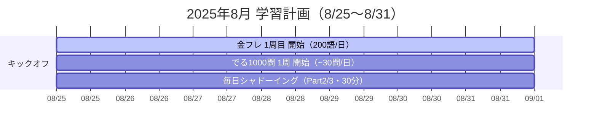
```mermaid
gantt
  title 2025年8月 学習計画（8/25〜8/31）
  dateFormat  YYYY-MM-DD
  axisFormat  %m/%d

  section キックオフ
  金フレ 1周目 開始（200語/日）        :active, a1, 2025-08-25, 7d
  でる1000問 1周 開始（~30問/日）       :a2, 2025-08-25, 7d
  毎日シャドーイング（Part2/3・30分）   :a3, 2025-08-25, 7d
```

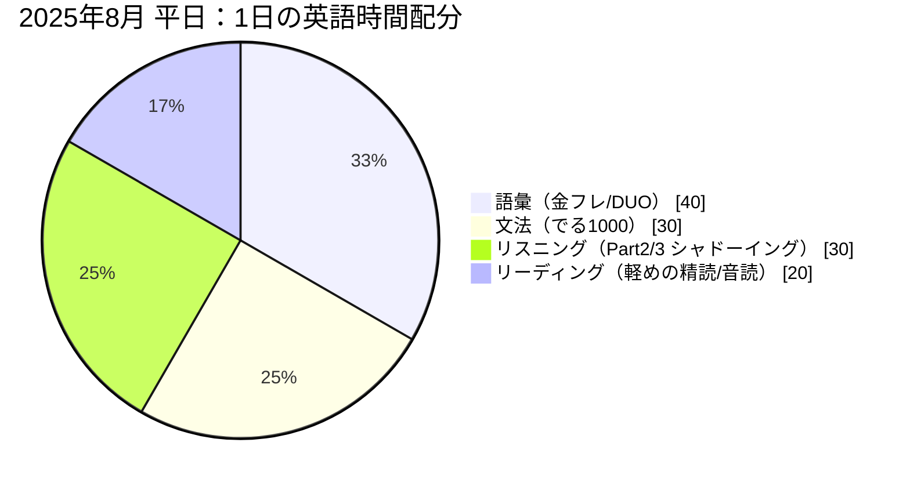
```mermaid
pie showData
title 2025年8月 平日：1日の英語時間配分
"語彙（金フレ/DUO）" : 40
"文法（でる1000）"   : 30
"リスニング（Part2/3 シャドーイング）" : 30
"リーディング（軽めの精読/音読）" : 20

```

## 2025年9月（基礎固め 完了目標）
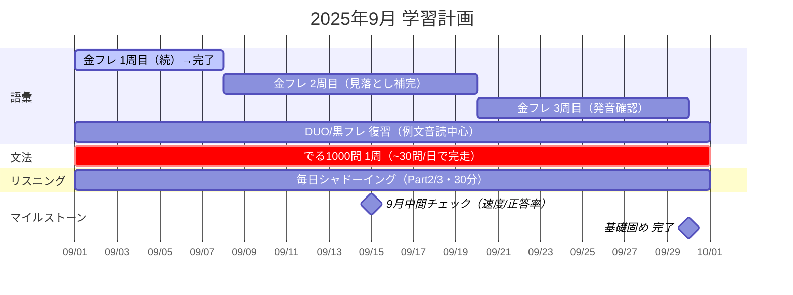
```mermaid
gantt
  title 2025年9月 学習計画
  dateFormat  YYYY-MM-DD
  axisFormat  %m/%d

  section 語彙
  金フレ 1周目（続）→完了              :active, b1, 2025-09-01, 7d
  金フレ 2周目（見落とし補完）         :b2, 2025-09-08, 12d
  金フレ 3周目（発音確認）             :b3, 2025-09-20, 10d
  DUO/黒フレ 復習（例文音読中心）       :b4, 2025-09-01, 30d

  section 文法
  でる1000問 1周（~30問/日で完走）     :crit, b5, 2025-09-01, 30d

  section リスニング
  毎日シャドーイング（Part2/3・30分）  :b6, 2025-09-01, 30d

  section マイルストーン
  9月中間チェック（速度/正答率）        :milestone, 2025-09-15, 0d
  基礎固め 完了                         :milestone, 2025-09-30, 0d


```

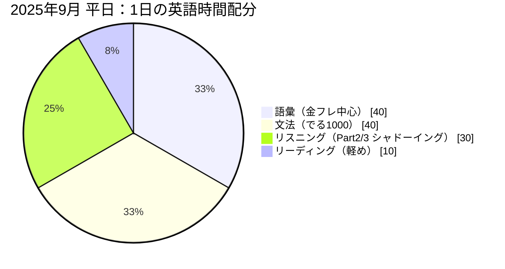
```mermaid
pie showData
title 2025年9月 平日：1日の英語時間配分
"語彙（金フレ中心）" : 40
"文法（でる1000）"  : 40
"リスニング（Part2/3 シャドーイング）" : 30
"リーディング（軽め）" : 10

```

## 2025年10月（応用・実戦強化）
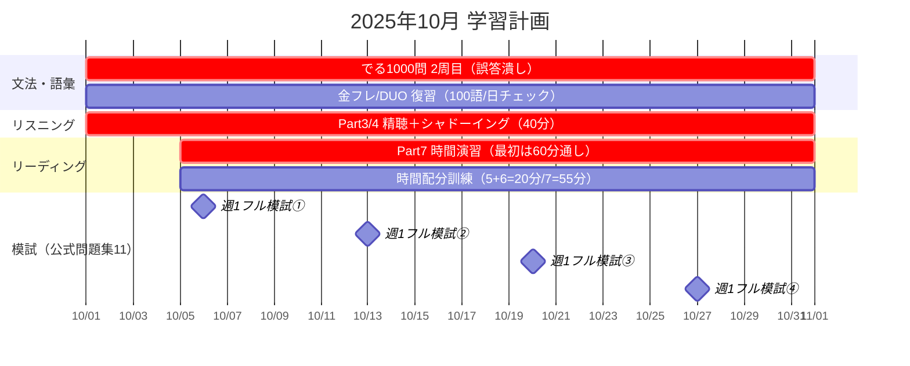
```mermaid
gantt
  title 2025年10月 学習計画
  dateFormat  YYYY-MM-DD
  axisFormat  %m/%d

  section 文法・語彙
  でる1000問 2周目（誤答潰し）         :crit, c1, 2025-10-01, 31d
  金フレ/DUO 復習（100語/日チェック）   :c2, 2025-10-01, 31d

  section リスニング
  Part3/4 精聴＋シャドーイング（40分）  :crit, c3, 2025-10-01, 31d

  section リーディング
  Part7 時間演習（最初は60分通し）      :crit, c4, 2025-10-05, 27d
  時間配分訓練（5+6=20分/7=55分）       :c5, 2025-10-05, 27d

  section 模試（公式問題集11）
  週1フル模試①                          :milestone, 2025-10-06, 0d
  週1フル模試②                          :milestone, 2025-10-13, 0d
  週1フル模試③                          :milestone, 2025-10-20, 0d
  週1フル模試④                          :milestone, 2025-10-27, 0d

```
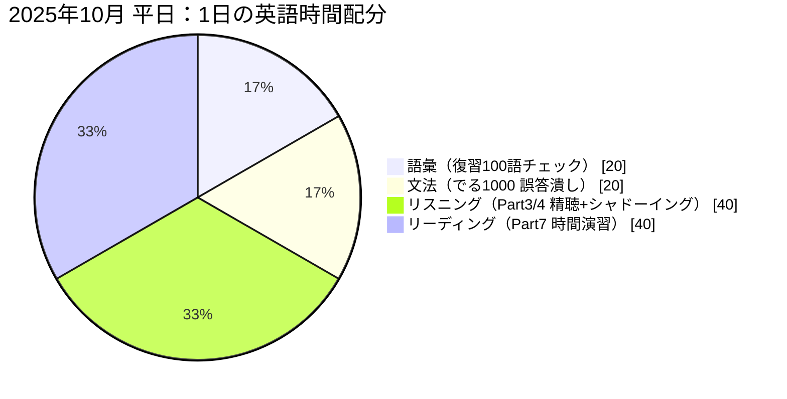
```mermaid
pie showData
title 2025年10月 平日：1日の英語時間配分
"語彙（復習100語チェック）" : 20
"文法（でる1000 誤答潰し）" : 20
"リスニング（Part3/4 精聴+シャドーイング）" : 40
"リーディング（Part7 時間演習）" : 40
```
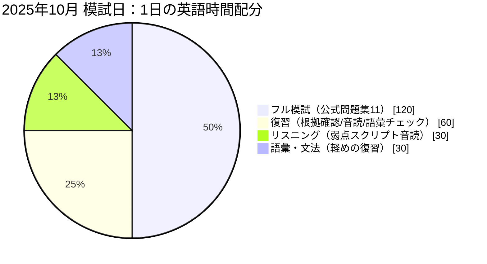
```mermaid
pie showData
title 2025年10月 模試日：1日の英語時間配分
"フル模試（公式問題集11）" : 120
"復習（根拠確認/音読/語彙チェック）" : 60
"リスニング（弱点スクリプト音読）" : 30
"語彙・文法（軽めの復習）" : 30

```

## 2025年11月（仕上げ）
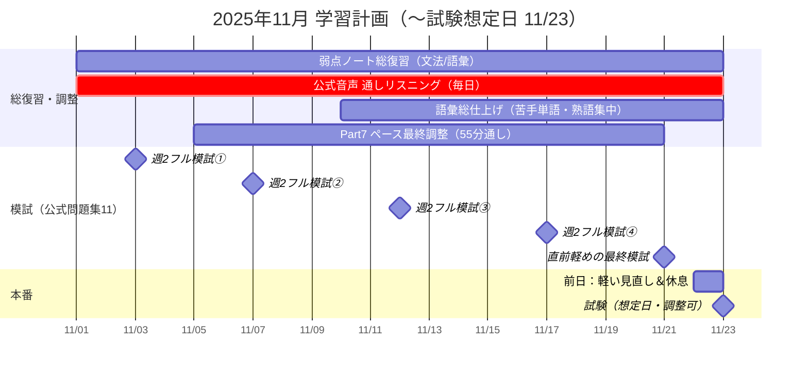
```mermaid
gantt
  title 2025年11月 学習計画（〜試験想定日 11/23）
  dateFormat  YYYY-MM-DD
  axisFormat  %m/%d

  section 総復習・調整
  弱点ノート総復習（文法/語彙）         :d1, 2025-11-01, 22d
  公式音声 通しリスニング（毎日）        :crit, d2, 2025-11-01, 22d
  語彙総仕上げ（苦手単語・熟語集中）     :d3, 2025-11-10, 13d
  Part7 ペース最終調整（55分通し）       :d4, 2025-11-05, 16d

  section 模試（公式問題集11）
  週2フル模試①                           :milestone, 2025-11-03, 0d
  週2フル模試②                           :milestone, 2025-11-07, 0d
  週2フル模試③                           :milestone, 2025-11-12, 0d
  週2フル模試④                           :milestone, 2025-11-17, 0d
  直前軽めの最終模試                      :milestone, 2025-11-21, 0d

  section 本番
  前日：軽い見直し＆休息                  :d5, 2025-11-22, 1d
  試験（想定日・調整可）                  :milestone, 2025-11-23, 0d

```

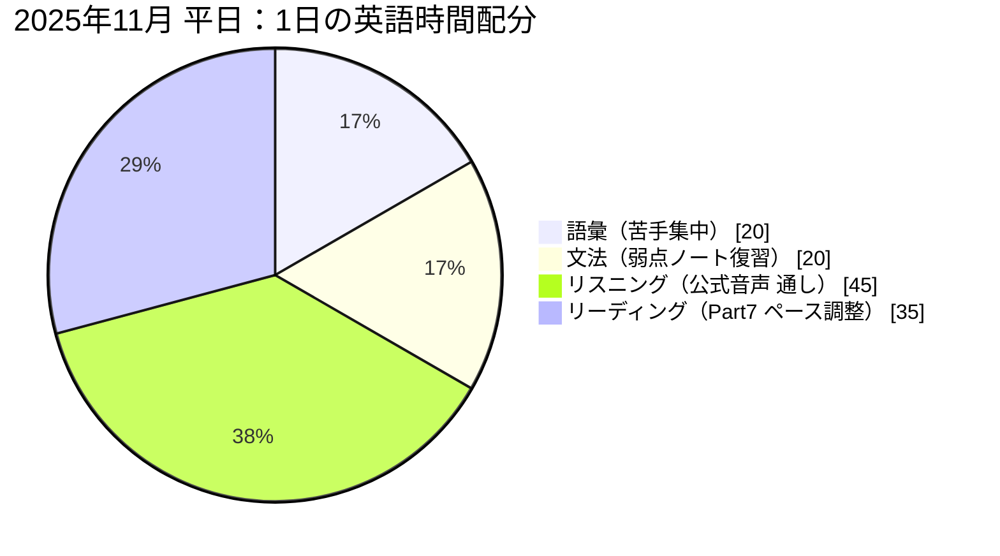
```mermaid
pie showData
title 2025年11月 平日：1日の英語時間配分
"語彙（苦手集中）" : 20
"文法（弱点ノート復習）" : 20
"リスニング（公式音声 通し）" : 45
"リーディング（Part7 ペース調整）" : 35

```

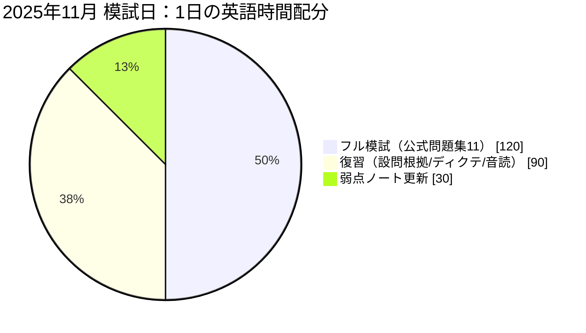
```mermaid
pie showData
title 2025年11月 模試日：1日の英語時間配分
"フル模試（公式問題集11）" : 120
"復習（設問根拠/ディクテ/音読）" : 90
"弱点ノート更新" : 30

```

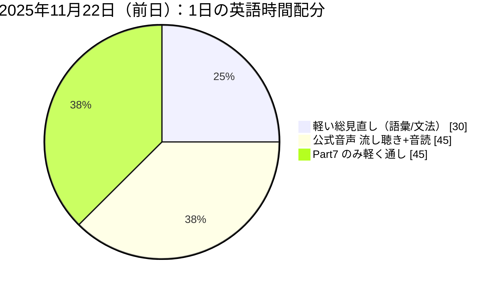
```mermaid
pie showData
title 2025年11月22日（前日）：1日の英語時間配分
"軽い総見直し（語彙/文法）" : 30
"公式音声 流し聴き+音読" : 45
"Part7 のみ軽く通し" : 45
```

