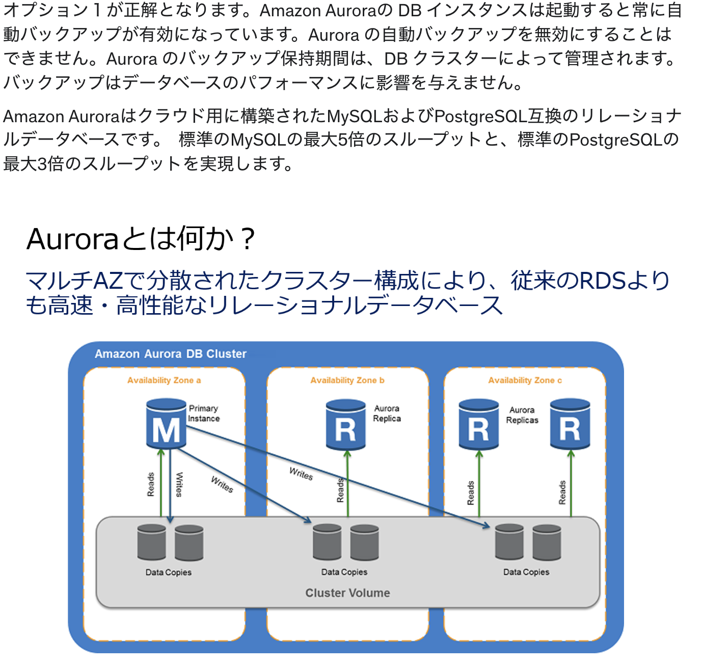

# Note

セキュリティグループ VS ネットワークACLs

EC2インスタンスの購入オプション

覚えておくべき移行関連のAWSサービス

EBSのバックアップ方法

AWSのデータサービス

AWSのメッセージサービス系

AWSのゲートウェイ系

グローバルリージョン設置

それぞれのストレージ

S3のデータ容量制限

Amazon Aurora

Snowball

S3タイプ

AWSのリレーショナルデータベース

AWSのNoSQL型データベース

データベースにおけるアンマネージド VS マネージド

Sass vs Pass vs Iaas

## 用語
### カーブアウト
> 企業が事業の一部を切り出し、その事業を社外事業の1つとして独立させること
> VPCを利用することで、AWSクラウドの一部をカーブアウトした仮想ネットワークにAWSリソースを起動することが可能
> VPCは、AWSクラウドのネットワークからユーザー専用の領域を切り出すことができる仮想ネットワークサービス

### フェイルオーバー
> 稼働中のシステムで問題が生じてシステムやサーバが停止した際、自動的に待機システムに切り替える仕組み
> RDSにおいてプライマリーデータベースが応答しない場合、RDSのマルチAZ構成によって自動フェイルオーバーが実行される

