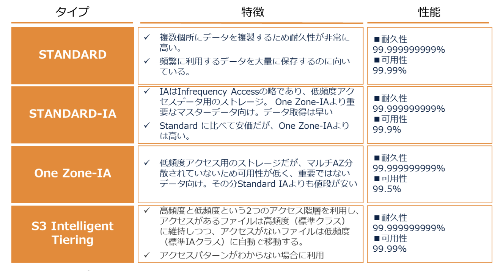
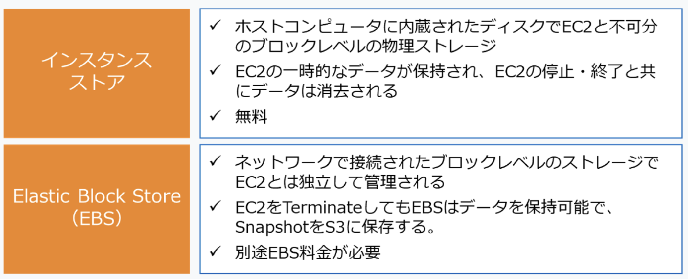

# Note

AWSの主要サービス一覧

AWSのコンピューティング関連のサービス

セキュリティグループ VS ネットワークACLs

EC2インスタンスの購入オプション

覚えておくべき移行関連のAWSサービス

EBSのバックアップ方法

AWSのデータサービス

AWSのメッセージサービス系

AWSのゲートウェイ系

グローバルリージョン設置

それぞれのストレージ

S3のデータ容量制限

Amazon Aurora

Snowball

S3タイプ

AWSのリレーショナルデータベース

AWSのNoSQL型データベース

データベースにおけるアンマネージド VS マネージド

Sass vs Pass vs Iaas

S3 MFA Delete

Transfer Acceleration

AWS WAF (ウェブアプリケーションファイアウォール)

AWSのファイアーウォール関連のサービス

Amazon EMR (Amazon Elastic MapReduce)

セキュリティの自動検知系サービス

分析サービス

ロードバランサー

ブロックレベルのストレージ

AWS Config

AWSのモニタリング系のサービス

Amazon EFS
> Amazon Elastic File System (Amazon EFS) は、NASと同じ機能を提供するファイル形式のストレージサービスです。伸縮自在な完全マネージド型の NFS ファイルシステムを提供します。

Amazon EC2インスタンスに接続

## 用語
### カーブアウト
- 企業が事業の一部を切り出し、その事業を社外事業の1つとして独立させること。
- VPCを利用することで、AWSクラウドの一部をカーブアウトした仮想ネットワークにAWSリソースを起動することが可能
- VPCは、AWSクラウドのネットワークからユーザー専用の領域を切り出すことができる仮想ネットワークサービス

### フェイルオーバー
- 稼働中のシステムで問題が生じてシステムやサーバが停止した際、自動的に待機システムに切り替える仕組み
- RDSにおいてプライマリーデータベースが応答しない場合、RDSのマルチAZ構成によって自動フェイルオーバーが実行される

### リードレプリカ
- 更新用データベース（マスター）からレプリケーションされた参照専用のデータベース
- アプリケーション側で更新用DBと参照用DBを使い分けることで負荷分散可能
- 「リードレプリカのスケールアウト」とは、複数の参照専用DBを作成し、参照トラフィックを分散処理することでマスターDBの負荷を軽減し、DB全体の性能を向上させること
- Amazon RDSはリードレプリカを別リージョンに設置することで、DBの読み取り処理用データベースを冗長化して、コスト最適に災害復旧対応を実現することができます。リードレプリカは読取専用のDBインスタンスの複製です。この機能によって、1 つの DB インスタンスのキャパシティーを伸縮自在にスケールし、読み取り頻度の高いデータベースのワークロードを緩和できます。

### プロビジョニング
- 事前に必要なリソース量を予測して準備しておくこと

