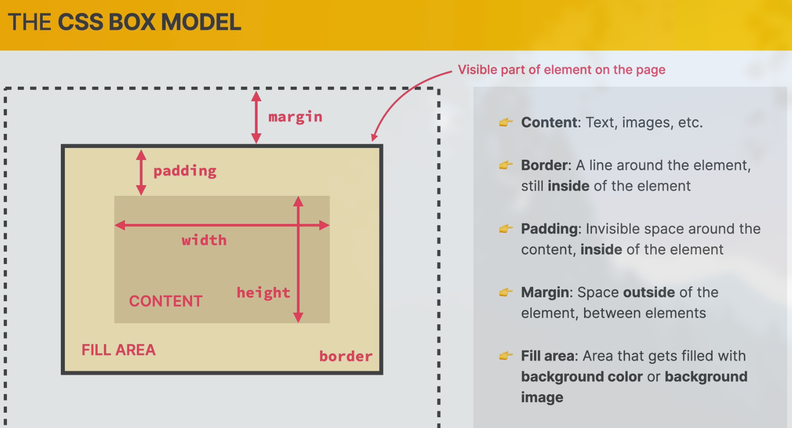
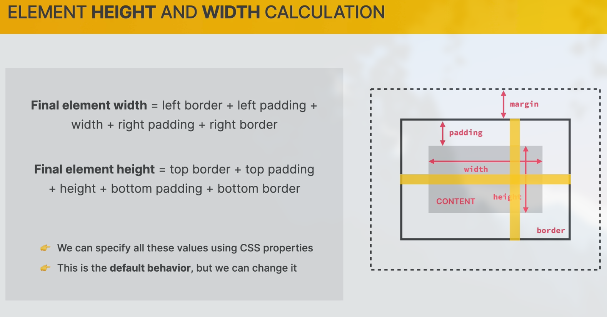
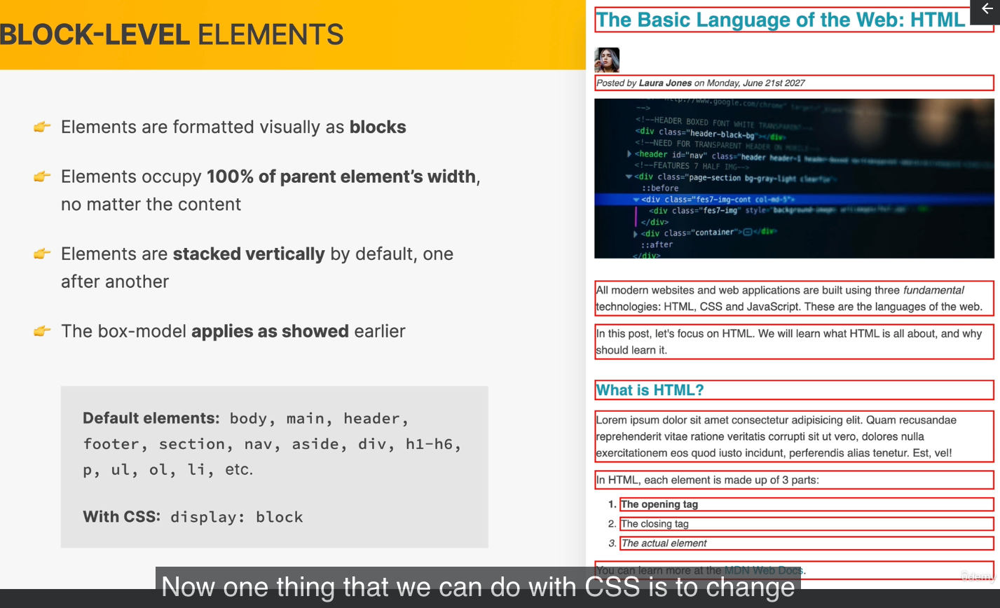
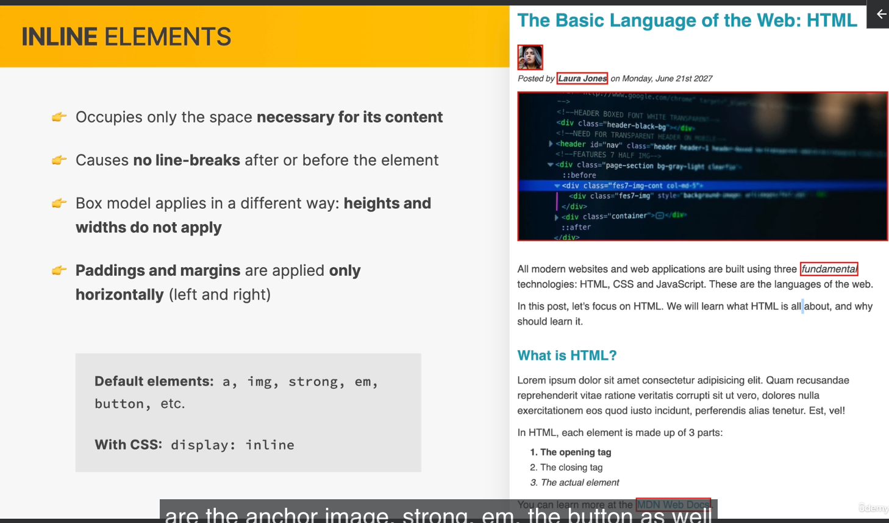
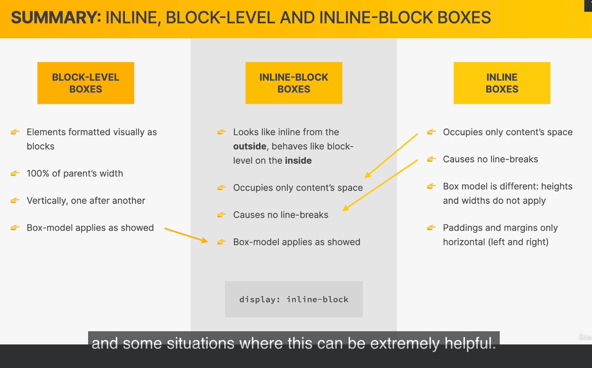
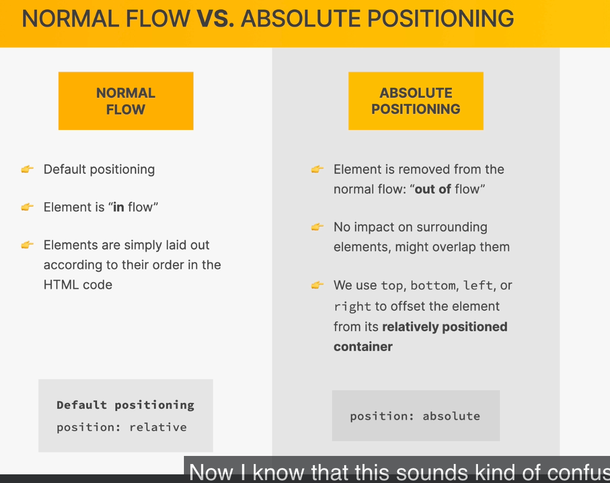

# Read Before You Start!

1️⃣ Download starter code
Before starting the course, please download the starter files and final code from the GitHub repo below 👇
https://github.com/jonasschmedtmann/html-css-course

🚨 Please read the FAQ on GitHub! Believe me, you will ask some of these questions eventually 😉

👉 Starter and final code and FAQs on GitHub

2️⃣ Download course material
Please also download the additional materials from the end of this lecture (choose just one of the theory-lectures): 👇

👉 theory-lectures-v2-BEST.pdf are slides for all theory lectures, with GOOD image quality (481 MB download)

👉 theory-lectures-v2-SMALLER.pdf are slides for all theory lectures, with AVERAGE image quality (158 MB download)

👉 all-design-guidelines.pdf is a summary of all the web design rules and guidelines we will study in Section 5

3️⃣ Community & resources
👉 We have a very friendly student community on Discord with 75,000+ students. This is where you learn together with other students just like you, and it's also where you can get updates on new courses. Join by clicking here!

👉 During the course, we use many online tools and resources, which are all on my resources page.

👋 Pro tip: Don't use lecture numbers when taking notes, because they will change each time I update something in the course.

And now, have a lot of fun with the course! 😁

### Box Model

### Elements Level

### Positioning

