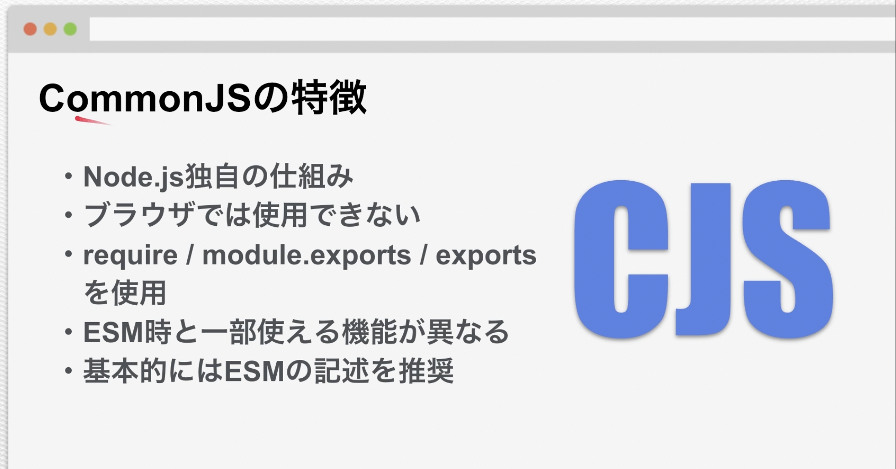

# Note

## Section3: JavaScript 基礎

## Section4: Node.js 基礎




### インポート方法

`example.js`

```js
const calc = require("./calc");
const { minus } = require("./calc");
const result = calc.plus(1, 2);
const result2 = minus(1, 2);
```

`calc.js`

```js
const plus = (a, b) => a + b;
function minus(a, b) {
  return a - b;
}
module.exports = {
  plus: plus,
  minus,
};
```


### インポート方法

`example.js`

```js
import { plus } from "./calc.js";
const result = plus(1, 2);
console.log(result);
```

`calc.js`

```js
function plus(a, b) {
  return a + b;
}
function minus(a, b) {
  return a - b;
}
export { plus, minus };
```

`package.json`

```js
{
  "type": "module"
}
```

### **dirname, **filename の ESM での代替手段

```js
import { fileURLToPath } from "url";
import { dirname } from "path";

const __filename = fileURLToPath(import.meta.url);
const __dirname = dirname(__filename);

// or

const __dirname2 = fileURLToPath(new URL(".", import.meta.url));

console.log(__filename);
console.log(__dirname);
console.log(__dirname2);
```

### ESM で JSON を読み込む方法

```js
// 1 createRequire の使用
import { createRequire } from "module";
const require = createRequire(import.meta.url);
const jsonObj = require("path/to/filename.json");

// 2 (Node 19 Experimental)
import jsonObj from "path/to/filename.json" assert { type: "json" };
```

## Section4: npm 基礎

### コマンド

```bash
# install <package>
$ npm install <package>

# install devDependencies <package>
$ npm install <package> -D

# show available package versions
$ npm view <package> versions

# install specific version <package>
$ npm install <package>@1.1.1

# show installed packages
$ npm ls

# install packages by package.json
$ npm install

```

### npm script

下記のスクリプトの`scripts`に任意のコマンドを登録できる。  
実行方法は`npm run <script key>` .
設定したコマンドにオプションを流したい場合は`--`を挟んで追加できる  
(e.g. `npm run <npm script> -- --port=3000`)

```js
{
  "name": "npm-script",
  "version": "1.0.0",
  "main": "main.js",
  "type": "module",
  "private": true,
//   $ npm run devのようにコマンド実行ができる
  "scripts": {
    "dev": "node main.js",
    "test": "node main.js",
    "hello": "echo \"Hello\"",
    "start": "live-server index.html"
  },
  "keywords": [],
  "author": "",
  "license": "ISC",
  "dependencies": {
    "is-odd": "^3.0.1"
  },
  "devDependencies": {
    "live-server": "^1.2.2"
  },
  "description": ""
}
```

### npx

ローカルパッケージを実行できる

```bash
$ npx live-server
```
