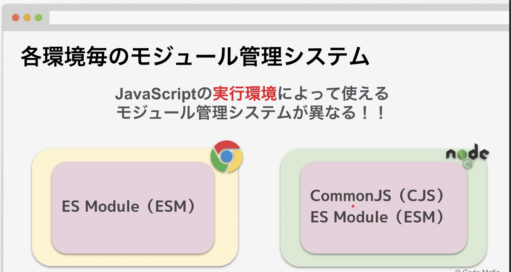

# Note

## Section3: JavaScript 基礎

## Section4: Node.js 基礎




### インポート方法

`example.js`

```js
const calc = require("./calc");
const { minus } = require("./calc");
const result = calc.plus(1, 2);
const result2 = minus(1, 2);
```

`calc.js`

```js
const plus = (a, b) => a + b;
function minus(a, b) {
  return a - b;
}
module.exports = {
  plus: plus,
  minus,
};
```


### インポート方法

`example.js`

```js
import { plus } from "./calc.js";
const result = plus(1, 2);
console.log(result);
```

`calc.js`

```js
function plus(a, b) {
  return a + b;
}
function minus(a, b) {
  return a - b;
}
export { plus, minus };
```

`package.json`

```js
{
  "type": "module"
}
```
