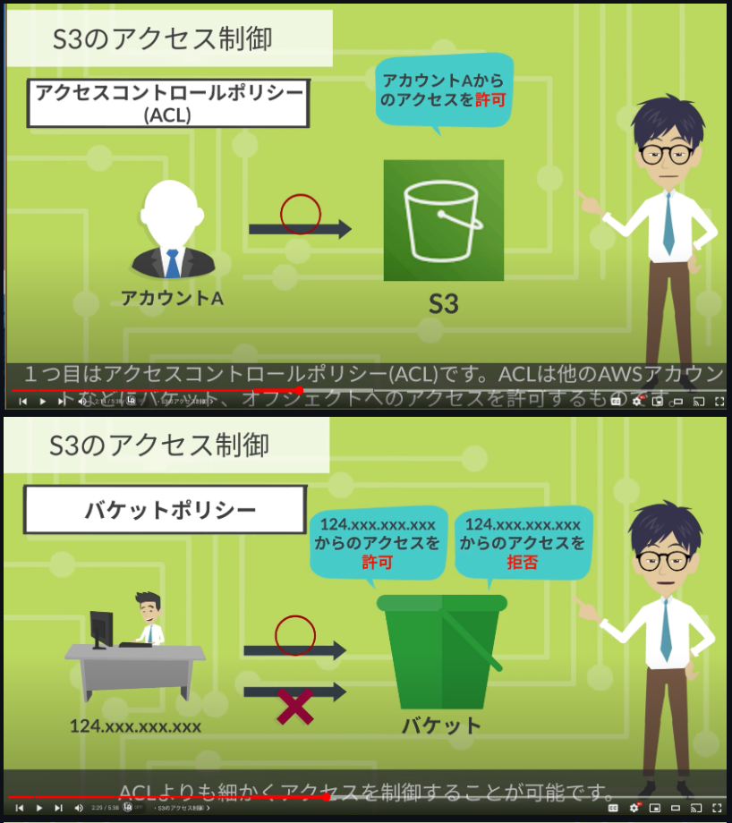
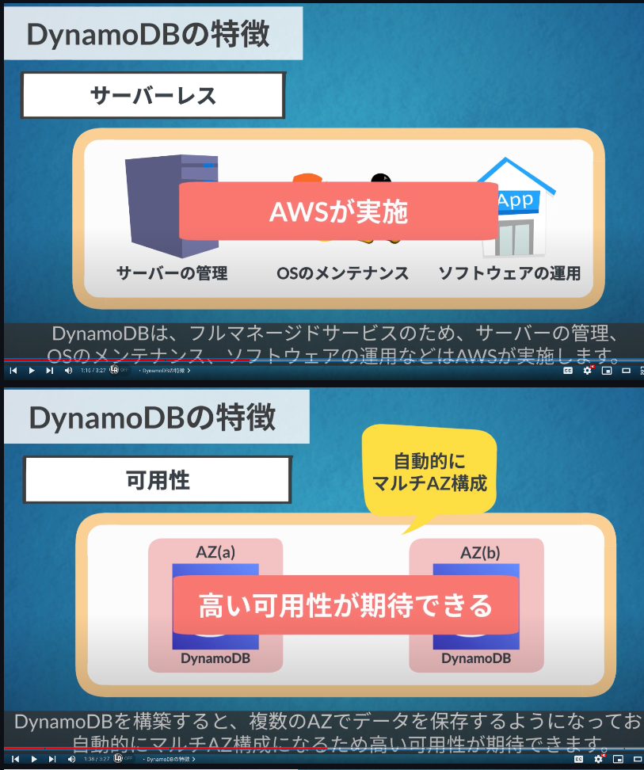
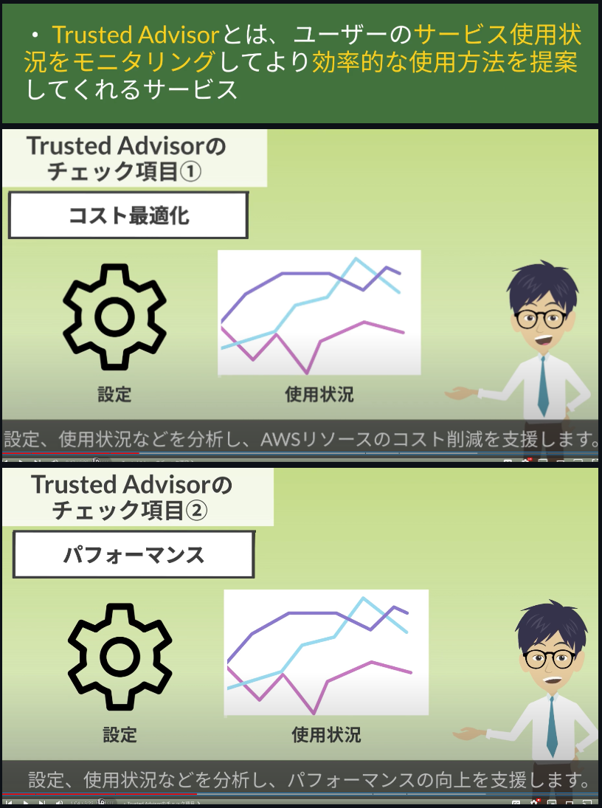

# テクノロジー分野(クラウドプラクティショナー)

## EC2

## EBS

## AMI

## ELB

## Lambda

## Auto Scaling

## S3

## EFS / Storage Gateway Snowball

## VPC

### インターネットゲートウェイはVPCに一つのみ作成可能

## VPCピアリングダイレクトコネクト

## Route53

### プライマリとセカンダリを設定しておくと、ルート53のヘルスチェックでプライマリに障害が発生した場合は、ルーティング先を自動的にセカンダリへフェールオーバーすることができます。このようにヘルスチェックとフェールオーバーを使用することで、システムの可用性を向上させることができます。

## Cloud Front

 # クラウドフロントはAWS利用者が使用しているドメインの証明書を使用することができ、ユーザーからhttpsのアクセスを受けることでデータを保護することが可能です。他にもAWSにおけるAWS WAF, AWS Shieldなど各種機能と連携して、リードス攻撃など複数のトラブルに対して階層化されたセキュリティで応戦することができます。

## RDS

## DynamoDB

## Redshift

## CloudTrail

## CloudWatch

## Trusted Advisor

## CloudFormation

